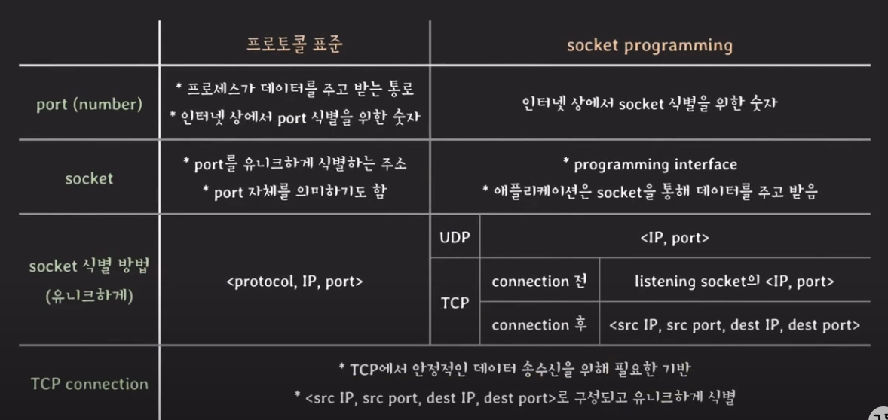

> 네트워크 프로그래밍, 실제 구현했을 때 어떻게 동작하는 지 관점에서 살펴 보기

- application
    - 시스템의 기능을 함부로 쓸 순 없음
    - 대신, 시스템은 애플리케이션이 네트워크 기능을 사용할 수 있도록 프로그래밍 인터페이스를 제공
        - 네트워크에서는 socket을 의미
    - 개발자는 socket programming을 통해 네트워크 상의 다른 프로세스와 데이터를 주고 받을 수 있도록 구현
       

- Socket
    - 대부분의 시스템은 'socket' 형태로 네트워크 기능 제공
    - 보통 socket을 직접 조작해서 통신 기능을 구현할 일은 적음
        - 라이브러리나 모듈 형태로 기능이 제공되고 있고 내부에는 socket을 활용해서 구현되어 있음을 확인할 수 있음
           

- socket은 <protocol, IP address, port number>로 유니크하게 식별되는가?
    - 실제 구현 관점에서 보았을 떄, UDP는 구별이되나 TCP는 구별이 안 됨
       

- TCP socket 동작 방식
    - server
        - connection 맺는 요청을 기다리는 'listening socket'이 별도로 있음
        - 동시에 여러 개의 connection이 연결되는 경우, socket의 <IP address, port number>가 동일하여 식별을 어떻게 하는가?
            - source ip, port도 같이 확인함으로써 유니크하게 식별함
    - client
        - OS에서 사용하지 않는 port number를 할당하여 사용
            - port number가 재사용될 수 있음
        - 동시에 여러 개의 server connection이 연결되는 경우
            - source ip, port도 같이 확인함으로써 유니크하게 식별함
- UDP socket 동작 방식
    - server
        - 'listening socke'이 따로 없음
        - UDP socket에서 데이터를 읽을 때, 어느 UDP socket으로 부터 왔는지 구별
    - client
        - 어느 UDP socket으로부터 보낼지 지정할 수 있음
           

- Port number
    - 16bits (0 ~ 65535)
    - 0 ~ 1023 : well-known ports, system ports
        - HTTP(80), HTTPS(443), DNS(53)
    - 1024 ~ 49151 : registered ports (IANA에 등록된 번호)
        - MySQL(3306), Apache tomcat server(8080)
    - 49152 ~ 65535 : dynamic ports
        - 등록 안된 번호, 임시로 혹은 자동 할당될 때 사용!
           

> 정리 표

